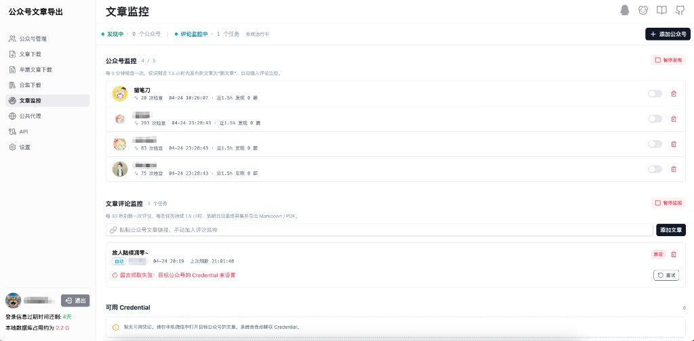

<p align="center">
  
</p>

<h1 align="center">wechat-article-monitor</h1>

<p align="center">
  微信公众号文章 / 评论自动化监控与导出工具
</p>

<p align="center">
  
  
  
  
</p>

<p align="center">
  
</p>

---

## 简介

`wechat-article-monitor` 是一个 **本地优先 (local-first)** 的微信公众号内容采集与归档工具。所有抓取到的文章、评论、阅读量等数据全部存入浏览器端的 IndexedDB，不依赖任何外部数据库即可长期运行。

它既支持一次性的文章批量导出，也支持：

- **关注一组公众号 → 定时轮询 → 自动入库新文章**
- **对入库文章持续追踪评论变化、记录被屏蔽评论的时间线**
- **通过 mitmproxy 抓包服务自动续期凭据，让监控任务无人值守**

适用场景：

- 长期跟踪若干公众号的更新与评论动态
- 把感兴趣的文章归档为多种格式（HTML / Markdown / DOCX / PDF / Excel / JSON / TXT）
- 团队 / 个人内容研究、舆情观察、合规留档

## 核心特性

### 内容采集与监控

- **公众号订阅与文章发现**：关注列表中的公众号定时轮询，新文章自动入库、自动去重
- **评论持续监控**：对入库文章追踪评论增减，记录每条评论的首次出现时间与被屏蔽时间
- **统一监控面板**：所有监控任务在一个页面管理，调度状态、失败次数、最近一次执行时间一目了然
- **离线可读**：抓取数据本地化存储，断网仍可浏览历史归档

### 多格式批量导出

- **HTML**（打包图片与样式，100% 还原原文排版）
- **Markdown / DOCX / PDF**
- **Excel / JSON / TXT**
- 支持图片消息、视频消息、合集
- 同步导出阅读量、点赞、转发、评论数据

### Credential 抓包服务

- 内置基于 mitmproxy 的本地 Python 服务，自动捕获并下发微信公众平台凭据
- 凭据剩余有效期实时显示在前端顶部条
- 通过 WebSocket 与前端联动 (`server/api/credential/ws.ts`)，过期前主动刷新

### 部署

- Docker 容器化
- Cloudflare Pages 一键部署

## 技术栈

| 层 | 技术 |
| --- | --- |
| 前端 | Nuxt 3 (SPA) · Vue 3 · TypeScript · Nuxt UI · TailwindCSS · AG Grid Enterprise · Monaco Editor |
| 服务端 | Nitro · Puppeteer (PDF) · Cheerio · Turndown |
| 存储 | Dexie / IndexedDB |
| 调度 | p-queue · 自研 Poller / Scheduler |
| 抓包服务 | Python 3.12+ · mitmproxy |
| 工具链 | Biome · Yarn 1.22 |

## 快速开始

### 环境要求

- Node.js ≥ 22
- Yarn 1.22（通过 corepack 管理）
- Python 3.12+（仅在使用 credential 抓包服务时需要）

### 安装与启动

```bash
corepack enable && corepack prepare yarn@1.22.22 --activate
yarn

cp .env.example .env
yarn dev
```

打开 <http://localhost:3000>，扫码登录公众号后台即可使用。

### Credential 抓包服务（可选）

```bash
cd credential-service
pip install -r requirements.txt
```

服务由 Nuxt 启动时通过 `server/plugins/credential-service.ts` 自动拉起，监听端口由 `CREDENTIAL_MITM_PORT` 控制。

### 生产构建

```bash
yarn build       # 生产构建（输出到 .output/）
yarn preview     # Cloudflare Pages 模式本地预览
yarn docker:build
```

## 配置

| 环境变量 | 说明 | 默认值 |
| --- | --- | --- |
| `NUXT_AGGRID_LICENSE` | AG Grid Enterprise 授权 | - |
| `NITRO_KV_DRIVER` | 存储驱动（本地/Docker 用 `fs`，Cloudflare 用 `cloudflare-kv-binding`） | `fs` |
| `NITRO_KV_BASE` | KV 数据目录 | `.data/kv` |
| `CREDENTIAL_MITM_PORT` | mitmproxy 监听端口 | `65000` |
| `NUXT_DEBUG_MP_REQUEST` | 是否打印代理请求日志（仅开发） | `false` |
| `DEBUG_KEY` | 调试端点鉴权 | - |

完整变量见 [`.env.example`](./.env.example)。

## 项目结构

```
.
├── apis/                  客户端 API 封装
├── composables/           Vue 组合式 API（监控、下载、导出）
├── components/dashboard/  仪表盘 UI
├── pages/dashboard/       路由页面（监控面板等）
├── server/api/            Nitro 服务端代理 / credential WebSocket
├── store/v2/              Dexie 数据模型
├── utils/monitor/         调度器与 poller
├── utils/download/        下载与导出核心
├── credential-service/    Python mitmproxy 抓包服务
└── openspec/              规格驱动开发文档
```

## 致谢

- [wechat-article/wechat-article-exporter](https://github.com/wechat-article/wechat-article-exporter) — 本项目的起点，原作者 [@Jock](https://github.com/wechat-article)
- [1061700625/WeChat_Article](https://github.com/1061700625/WeChat_Article) — 抓取原理参考

## 许可

[MIT](./LICENSE) © 2024 Jock · 2026 tomczhang

## 免责声明

本工具仅用于公开内容的本地归档与备份。通过本工具获取的微信公众号文章与评论内容，版权归原作者所有，请合理合规使用，严禁用于商业牟利、侵犯他人权益或违反平台规则的行为。

本程序不会利用扫码登录的公众号进行任何形式的私有爬虫，账号仅用于服务使用者本人的内容抓取目的。
