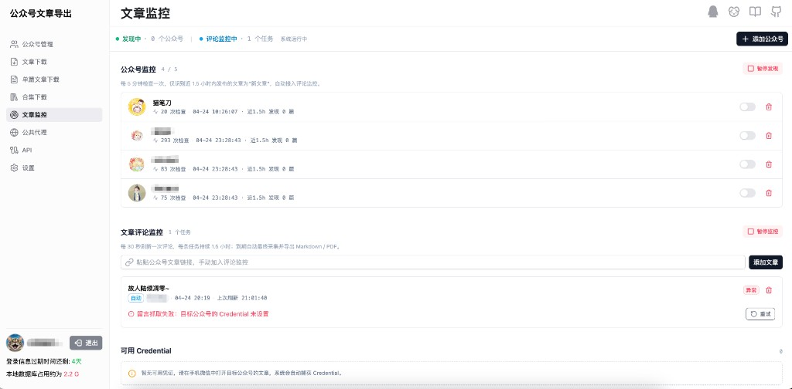

<p align="center">
  
</p>

<h1 align="center">wechat-article-monitor</h1>

<p align="center">
  微信公众号文章 / 评论自动化监控与离线阅读归档工具
</p>

<p align="center">
  
  
  
  
  
</p>

<p align="center">
  
</p>

---

## 简介

`wechat-article-monitor` 是一个 **本地优先 (Local-first)** 且高度可扩展的微信公众号内容采集、深度归档与沉浸式阅读工具。所有抓取到的文章、评论、阅读量等数据默认存入浏览器端 IndexedDB，无需任何外部数据库即可独立运行；同时无缝支持云端 PostgreSQL 数据库备份与大容量部署。

本项目核心面向个人备份、内容研究、舆情分析与合规留档等场景。无论是单次公众号全量备份，还是海量文章的动态追踪，本系统都能提供极致流畅的体验。

---

## 🌟 核心特性与近期重磅升级

### 1. 📖 新增：公众号离线沉浸式阅读器
- **双栏书架设计**：全新的独立阅读器（Reader）界面。左栏支持带圆角头像的公众号列表快速切换、全库文章标题实时模糊过滤检索、悬浮阴影列表卡片；右栏为极简沉浸式阅读正文。
- **4 款精选护眼主题**：提供 **“清爽纸白”**、**“复古麦香”**（暖沙经典纸底，极度缓解用眼疲劳）、**“柔和护眼”** 与 **“沉静暗黑”** 四套精美色盘，响应环境自如。
- **无级字号缩放**：提供字号缩小 (A-) / 放大 (A+) 按钮，支持在 `12px` 到 `28px` 之间自由缩放。
- **快捷翻页导航**：配备“上一篇”/“下一篇”快捷翻页控制，支持连续不间断阅读。
- **手机浏览器完美适配**：针对手机端视口重构了响应式布局。手机访问时自动合并为单栏排版，阅读时全宽展示，并配有手机专属的“一键返回列表”交互，体验媲美原生 App。
- **双重防盗链与头像修复**：通过重构留言引擎与 iframe 安全沙箱，全局锁定 `referrerpolicy="no-referrer"` 并适配安全 HTTPS 头像图片，**100% 还原微信原生留言板**（含头像、朋友标签、作者标识、IP属地等），彻底告别失真与图片破损。

### 2. 🚀 新增：数据库模式性能飞跃（分页与并发优化）
- **数据库级别物理分页**：后端 Nitro API 及 Drizzle ORM 层支持物理分页查询（`limit` / `offset` 参数与 `exclude_deleted` 过滤），前端默认 **每页展示 20 条** 历史文章，彻底解决百万级海量数据下一次性拉取带来的内存溢出和前端卡顿问题。
- **Promise.all 并发读取**：重构了列表的检索与缓存匹配链路，由原先的“单条串行”升级为 **并发异步读取**，列表翻页和加载耗时达到 **百毫秒级的瞬时载入**。

### 3. 🔄 新增：前后端双向“增量”数据迁移
- **极其智能的增量迁移**：系统全面支持 IndexedDB ↔ 云端 PostgreSQL 双向同步。
- **带宽与流量暴跌 99%**：在发起数据同步时，系统会自动进行正反向主键（ID）碰撞校验，**仅传输和覆盖两端互不存在的新记录**。在重复迁移或日常同步时，数千条记录仅需 **几百毫秒即可一闪而过瞬间同步完毕**，彻底避免了大体积 HTML 与多媒体图片资源的重复网络传输。

### 4. 🔑 新增：手动凭证录入与云端 VPS 联动
- **云端 VPS / 容器部署福音**：针对云端或 VPS 容器化部署无法启用本地 mitmproxy 的痛点，新增了客户端手动录入凭据表单，在前端即可瞬间解析出 `__biz`、`uin`、`key`、`pass_ticket` 并落盘。
- **本地 Proxyman 抓包秒级自动同步**：提供了详尽的 Proxyman 脚本同步解决方案。您只需在 Mac 本地 Proxyman 中配置一条极简的 Script 规则，当您在微信里点开文章时，本地 Proxyman 会在后台**自动拦截并秒级静默 POST 发送给云端的 VPS**，监控面板通过 WebSocket **即时点亮凭证绿灯**，享受 100% 自动化的抓取闭环。

---

## 🛠️ 技术栈

| 层次 | 核心技术选型 |
| --- | --- |
| **前端应用** | Nuxt 3 (SPA 模式) · Vue 3 · TypeScript · Nuxt UI · TailwindCSS |
| **交互网格** | AG Grid Enterprise · Monaco Editor (代码编辑器) · Day.js |
| **持久存储** | **IndexedDB**（本地优先驱动，基于 Dexie） / **PostgreSQL**（基于 Drizzle ORM） |
| **服务端 (Nitro)** | Node.js ≥ 22 · Puppeteer (高保真 PDF/图片转换) · Cheerio · DOMPurify |
| **队列调度** | p-queue 并发限流器 · 自研 Poller 轮询 / Scheduler 统一调度器 |
| **抓包辅助** | Python 3.12+ · mitmproxy / mitmdump 凭证自动捕获 |

---

## ⚡ 快速开始

### 本地运行要求

1. **Node.js** ≥ 22
2. **Yarn** 1.22（推荐开启 Corepack 管理）
3. **Python 3.12+**（仅在使用本地 mitmproxy 自动抓包服务时需要）

### 安装与启动

```bash
# 激活 Yarn 包管理器并安装依赖
corepack enable && corepack prepare yarn@1.22.22 --activate
yarn install

# 创建并配置环境变量
cp .env.example .env
yarn dev
```

打开浏览器访问 <http://localhost:3000>。在前端页面登录并扫码进入公众号平台即可开始使用！

---

## 🔑 本地 Proxyman 自动捕获上报配置（适用于容器化/VPS云部署）

如果您将项目部署在远程 VPS 的 Docker 容器中，无法使用容器内的 `mitmproxy`：
1. 本地 Mac 下载并安装抓包工具 [Proxyman](https://proxyman.io/)。
2. 安装并信任 Proxyman 证书以开启 `HTTPS Decryption`，匹配规则设定为 `mp.weixin.qq.com`。
3. 在 Proxyman 顶部选择 `Scripting` -> `Script List`，新建一个脚本并复制以下内容：

```javascript
function onResponse(request, response) {
    var url = request.url;
    var headers = request.headers;
    var cookie = headers["Cookie"] || headers["cookie"];

    if (url.includes("__biz") && url.includes("key") && cookie && cookie.includes("wap_sid2")) {
        console.log("[微信凭证同步] 检测到有效微信凭证，正在秒级上报至云端...");
        // ⚠️ 请在此处替换为您 VPS 容器的真实访问地址（如 http://your-vps-ip:3000）
        var vpsServer = "http://YOUR_VPS_IP:3000"; 
        
        HTTP.post(vpsServer + "/api/credential/upload", {
            headers: { "Content-Type": "application/json" },
            body: JSON.stringify({
                url: url,
                cookie: cookie,
                name: "Proxyman 自动抓包",
                avatar: ""
            })
        }, function(err, res) {
            if (!err) console.log("[微信凭证同步] 同步成功！" + res.body);
        });
    }
    return response;
}
```
开启脚本复选框。此后，您只要在 Mac 微信中点开公众号文章，本地凭证将**全自动秒级同步至您远端的容器中**！

---

## ⚙️ 核心环境变量配置

本项目的完整环境变量模板参见 [`.env.example`](./.env.example)。以下为常用关键变量说明：

| 环境变量 | 作用与说明 | 默认值 |
| --- | --- | --- |
| `NUXT_AGGRID_LICENSE` | AG Grid Enterprise 企业级数据表格授权密钥 | - |
| `NITRO_KV_DRIVER` | 后端 KV 存储驱动（本地/Docker 使用 `fs`，Cloudflare 部署选择 `cloudflare-kv-binding`） | `fs` |
| `NITRO_KV_BASE` | 本地存储 KV 数据存放物理路径 | `.data/kv` |
| `CREDENTIAL_MITM_PORT` | 本地 mitmproxy 凭证代理服务监听端口 | `65000` |
| `DATABASE_URL` | 云端 PostgreSQL 数据库连接地址（启用 Postgres 驱动时必填） | - |

---

## 📁 项目目录结构

```
.
├── apis/                  # 客户端 Axios/Fetch API 请求封装
├── composables/           # Vue 3 组合式逻辑层（大容量数据迁移、自动下载导出等）
├── components/dashboard/  # 仪表盘顶层 UI 骨架与核心动作栏
├── components/preview/    # 微信文章 HTML/图片 高端沙盒隔离预览组件
├── pages/dashboard/       # 系统路由页面（公众号管理、列表分页下载、独立阅读器等）
├── server/api/            # Nitro 服务端路由，提供 Proxy 代理与 WebSocket 下发接口
├── store/v2/              # 本地 IndexedDB (Dexie) 与 远端 PostgreSQL 双引擎存储适配层
├── utils/monitor/         # Poller 自动追踪器与并发任务调度逻辑
└── utils/download/        # 微信原生高保真 HTML 排版提取与 PDF 深度导出引擎
```

---

## 致谢

- [wechat-article/wechat-article-exporter](https://github.com/wechat-article/wechat-article-exporter) — 本项目的优秀起点，感谢原作者 [@Jock](https://github.com/wechat-article) 的开源精神。
- [1061700625/WeChat_Article](https://github.com/1061700625/WeChat_Article) — 核心抓取原理的极佳参考。

---

## 许可

[MIT](./LICENSE) © 2024 Jock · 2026 gopherty666

---

## 免责声明

本工具仅用于学术研究与个人对公开内容的本地归档和防丢失备份。通过本工具获取的微信公众号文章与评论内容，版权均归微信平台原作者所有，请合理合规使用，严禁用于任何形式的商业牟利、侵犯他人隐私或违反平台运营规则的行为。

本软件绝不包含也绝不在后台执行任何针对扫码登录账号的恶意探测或未经许可的私有爬虫，所有数据抓取均完全服务于使用者自身授权的内容归档目的。
